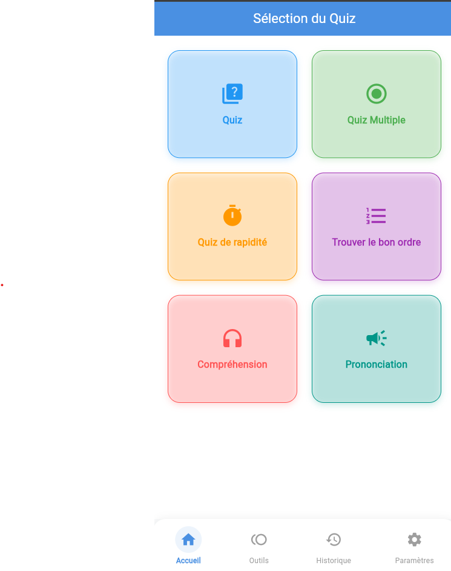

# LearnLanguage | Flutter Multi-Platform App

**LearnLanguage** is a comprehensive e-learning solution designed to master English. Powered by the **Flutter** framework, the application delivers a fluid and interactive experience across **any device** (Mobile, Tablet, and Web).

##  Quick Access
*  **Web App (PWA):** [Launch Application](https://learn-language-ten.vercel.app/)
*  **Android (APK):** [Download v1.0.0](https://github.com/MatthieuFranques/LearnLanguage/releases/tag/v1.0.0)

---

##  Interface Preview

  

---

##  Key Features

The app offers various pedagogical modules for total linguistic immersion:

*  **Advanced Quiz Engines**:
    * *Multiple Choice (MCQ)*: Sharpen grammar and vocabulary precision.
    * *Speed Run*: Boost cognitive reactivity and linguistic reflexes.
    * *Syntax Builder*: Sentence reconstruction algorithm to master sentence structure.
*  **Audio & Phonetics**:
    * *Listening Comprehension*: Active listening drills.
    * *Pronunciation Module*: Interactive feedback on speaking skills.
*  **Integrated Lessons**: Quick access to essential grammar rules and vocabulary sheets.

---

##  Tech Stack & Compatibility

* **Framework**: [Flutter](https://flutter.dev/) (Dart)
* **Supported Devices**: 
    *  **Mobile**: (Android & iOS*)
    *  **Desktop & Web**: (Chrome, Firefox, Safari)
    *  **PWA Support**: Installable as a native-like app directly via your browser.

---

##  Why this project?

Developed to prepare for an upcoming trip to an English-speaking country, **LearnLanguage** goes beyond generic tools by offering targeted exercises. This project demonstrates Flutter's capability to maintain a single codebase for high-quality deployment on **every screen**.

