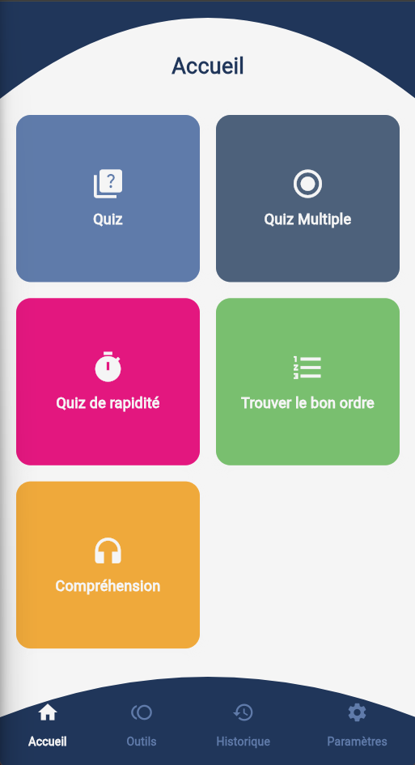

# LearnLanguage

**LearnLanguage** est une application conçue pour s'améliorer en anglais grâce à différents quiz ludiques et outils interactifs. Elle permet d’apprendre la langue de manière efficace et motivante, avec des exercices adaptés à tous les niveaux.

---

## Présentation

LearnLanguage propose une variété de quiz et leçons pour progresser en anglais, en travaillant la compréhension, la grammaire, la prononciation, et plus encore. L’application combine apprentissage structuré et exercices pratiques pour une expérience complète.




---

## Fonctionnalités principales

- **Quiz variés** : testez vos connaissances avec différentes formes d’exercices.
- **Quiz à choix multiples** : travaillez compréhension et précision.
- **Quiz de rapidité** : améliorez votre fluidité en répondant rapidement.
- **Trouver le bon ordre** : réorganisez les mots ou phrases pour renforcer la syntaxe.
- **Compréhension** : exercices axés sur l’écoute.
- **Prononciation** : outils et exercices pour améliorer votre accent.
- **Leçons intégrées** : explications claires sur la grammaire, le vocabulaire et les règles essentielles.

---

## Pourquoi ce projet ?

Bientôt en voyage dans un pays anglophone, j’ai conçu cette application pour progresser efficacement en anglais. Plutôt que de recourir à des outils génériques, j’ai souhaité créer une solution personnalisée et complète, proposant des quiz adaptés à mes besoins ainsi qu’un suivi pédagogique à travers des leçons intégrées.

---

# Installation

> ⚠️ **Warning :**  
> Cette application **n'a pas encore été testée sur iOS**.  
> L'utilisation sur cette plateforme peut présenter des bugs ou des comportements non prévus.

### Prérequis

- Flutter SDK installé ([Installation Flutter](https://flutter.dev/docs/get-started/install))
- Un émulateur ou un appareil connecté pour tester

1. Clonez le dépôt :

   ```bash
   git clone <URL_DU_DEPOT>
   cd LearnLanguage

2. Installez les dépendances nécessaires : 

        flutter pub get

3. Lancez l’application 

        flutter run

### Générer un build release

        flutter build apk --release
